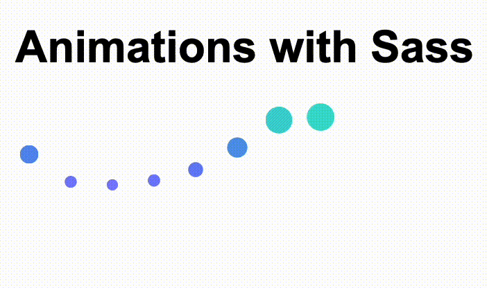

# Animation with Sass



## What is it

Is lab demo in how we can powered animation from Sass functions

## Instructions

Try to replicate the animation showed in the GIF above using Sass and CSS animations.

Write all your styles in the sass file located in `./styles/sass/main.scss` and run the sass compiler

## How to compile

Install Sass

```sh
yarn global add sass
```

Compile

```sh
sass ./styles/scss/main.scss ./styles/css/main.css -w
```
