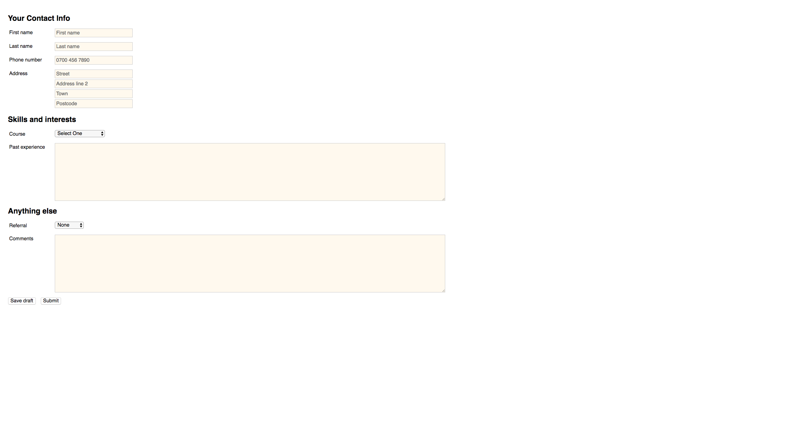

# Responsive form lab

## Task

- Create a responsive form as per design

## Acceptance criteria

- Colours are `#ccc` and `#fffaf0`
- Small breakpoint is 600px;
- `textarea` max width is `800px`
- `input`s max width `250px`
- `label`s max width `150px`
