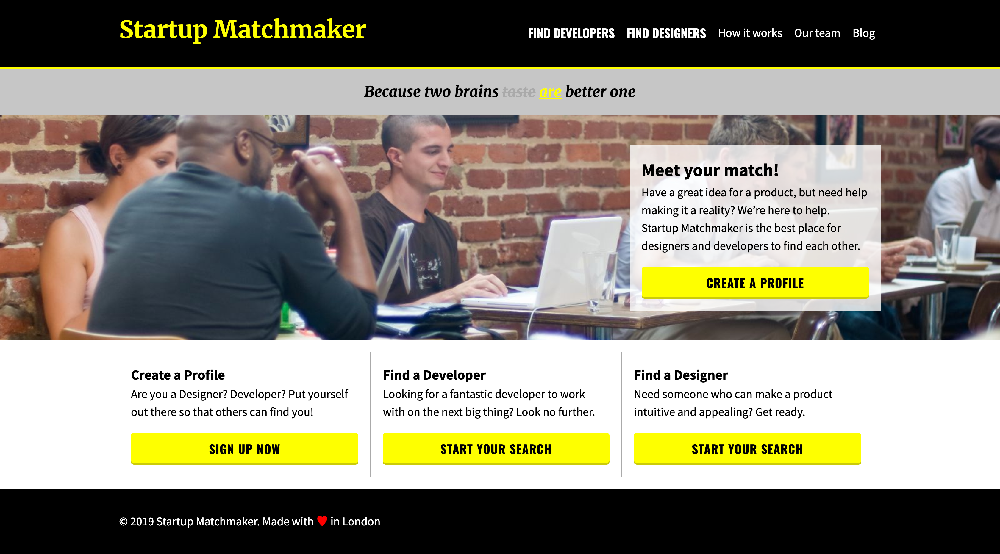

# FEWD Week 4 Lab

## What is it

Together we are going to build a responsive website.

## Designs

You can find design for this website [here](./designs)



## Colours

- alpha-black: rgba(0, 0, 0, 0.2);
- alpha-white: rgba(255, 255, 255, 0.8);
- black
- darkgrey: #aaa;
- grey: #c6c6c6;
- red
- white
- yellow

## Fonts

- Merriweather: heading 1 and tagline
- Oswald: navigation menu and call to action buttons
- Source Sans Pro: everything else

```html
<link
  rel="stylesheet"
  href="http://fonts.googleapis.com/css?family=Source+Sans+Pro:400,700|Oswald:700|Merriweather:700,700italic"
/>
```

## Requirements

- Content not wider than `1280px`
- Padding `20px`;
- Font size `20px`
- Mobile breakpoint `740px`

## Content

```txt
# Startup Matchmaker

- Find Developers
- Find Designers
- How it works
- Our team
- Blog

Because two brains taste are better one

## Meet your match!
Have a great idea for a product, but need help making it a reality? We’re here to help.
Startup Matchmaker is the best place for designers and developers to find each other.


### Create a Profile
Looking for a fantastic developer to work with on the next big thing? Look no further.

## Find a Developer
Looking for a fantastic developer to work with on the next big thing? Look no further.

### Find a Designer
Need someone who can make a product intuitive and appealing? Get ready

© 2019 Startup Matchmaker. Made with ♥ in London

```
