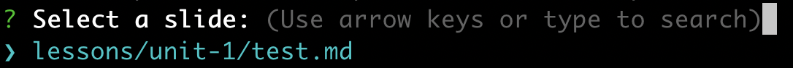

# Lessons

## What is it

Nx library for all lessons.

It is written in Markdown and formatted with Remark [syntax][remark-syntax].

Can be used as stand alone slides deck or been added to any website in this repo.

## How to contribute

The slides are divided into 5 units:

- [bonus](./src/lessons/bonus): Bonus lessons
- [FEWD](./src/lessons/fewd): Front-End Web Development course
- [FEWD ES](./src/lessons/fewd-es): Front-End Web Development course in Spanish 🇪🇸 with React
- [JSD](./src/lessons/jsd): JavaScript Development cource
- [SEI ES](./src/lessons/sei-es): Software Engineer Immersive in Spanish 🇪🇸

Choose a folder and then create a mardown file and name it using a kebab case convention, e.g: `css-grids.md`.

Use [Remark syntax][remark-syntax] to write the slides.

## How to deploy

### FEWD

To deploy the markdown slides to FEWD

```sh
pnpm nx run lessons:copyFewdLessons
```

[@websites]: ../@websites/readme.md
[remark-syntax]: https://github.com/gnab/remark/wiki/Markdown

## How to run as a standalone slide deck

1. From the root of the monorepo type on your terminal

   ```sh
   pnpm nx run lessons:serve
   ```

2. It will prompt you with:
   
3. Type to search or use arrow keys (<kbd>&#8593;</kbd>and <kbd>&#8595;</kbd>) to navigate slides
4. Select a slide deck
5. 🚀

### Presentation

Presentation mode can be activated/deactivated by pressing the <kbd>P</kbd> key on your keyboard while having the window focused.

You will be presented with your current slide, a preview of the next slide, your current and next slide notes as well as a timer.

Additionally you can press <kbd>C</kbd> to create a new window where the same presentation will be displayed. This window is linked to the main window. Changing slides on one will cause the slide to change on the other.

### Keyboard shortcuts

All of these shortcuts can also be seen during a presentation by pressing <kbd>H</kbd> or <kbd>?</kbd>

- <kbd>H</kbd> or <kbd>?</kbd>: Toggle the help window
- <kbd>J</kbd>: Jump to next slide
- <kbd>K</kbd>: Jump to previous slide
- <kbd>B</kbd>: Toggle blackout mode
- <kbd>M</kbd>: Toggle mirrored mode.
- <kbd>C</kbd>: Create a clone presentation on a new window
- <kbd>P</kbd>: Toggle PresenterMode
- <kbd>F</kbd>: Toggle Fullscreen
- <kbd>T</kbd>: Reset presentation timer
- **&lt;number&gt;** + <kbd>Enter</kbd>: Jump to slide &lt;number&gt;

### How to print

Just save as PDF from the browser

> Only works on Google Chrome 🙃
